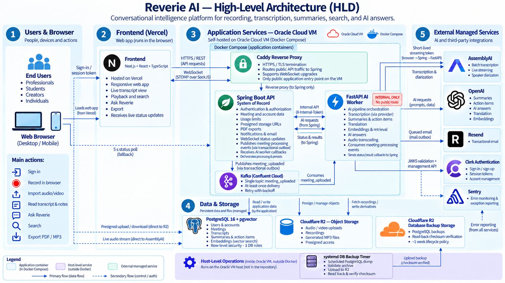

# Reverie

**Turn a recorded conversation into a transcript, notes you can act on, and answers you can ask for later.**

[](https://reverieai.in)     

**Live app → [reverieai.in](https://reverieai.in)**

---

## What is Reverie?

Record a meeting in your browser, or import an audio or video file. Reverie
writes down what was said, separates the speakers, and turns the conversation
into a summary with decisions, risks and action items.

It then stays searchable. Find a phrase from weeks ago, or ask a question in
plain English about one meeting or all of them — answers come with links to the
transcript sections that support them.

## The Problem

After a meeting you are usually left with:

- an hour of audio nobody will play again
- notes that stop where somebody stopped typing
- a decision everyone remembers differently
- tasks agreed out loud and written down nowhere
- no way to find what was said three weeks ago

Reverie turns the recording into text, the text into short notes, and keeps
both answerable.

## Who It Is For

- Students recording lectures and research interviews
- Professionals in more meetings than they can write up
- Developers and small teams tracking decisions and follow-ups
- Anyone taking interview notes who needs quotes attributed correctly

Reverie is single-account today: each account sees only its own meetings.

## Live Demo

**[reverieai.in](https://reverieai.in)** — sign in or create an account.

Every account gets the same free allowance: **100 transcription minutes for the
life of the account** and **3 imported files**. Browser recording spends minutes
but does not count as an import. No paid tier, and no demo credentials here.

## Product Preview

<!--
  SCREENSHOTS TO BE ADDED from https://reverieai.in: landing page; Home with the
  ask panel; a summary with decisions, risks and action items; the transcript
  with speakers and timestamps; Ask Reverie with a citation resolved into the
  transcript.
-->

_No screenshots in the repository yet — see [reverieai.in](https://reverieai.in)._

## Core Features

Everything below is reachable in the product today.

### Capture

- **Record in the browser** — words appear as you speak, and leaving the page
  does not stop the recording.
- **Import an audio or video file** you already have.
- **Transcription in 18 languages**, auto-detected or fixed in settings.
- **Speakers separated, numbered and renameable** — labelled per word, so a
  short interjection is attributed to whoever actually said it.

### Understand

- **A summary with key points**, written to a template you pick per meeting.
- **Decisions and risks**, read out of that summary and editable.
- **Action items** with owners, due dates and comments.
- **Quotations checked against the transcript** before they are stored.
- **The whole meeting in another language** — summary, tasks and transcript.

### Find

- **Ask about one meeting or all of them**, with citations to the transcript.
- **Quick or Thorough** — how much of the conversation an answer reads.
- **Search every sentence anyone said**, narrowed by tag, type, folder or date.
- **An outline of each meeting**, with jump-to navigation.

### Organise

- **Folders** (up to 200) and **tags**, with date filtering.
- **Edit the transcript and speaker labels** when something came through wrong.
- **Highlights, bookmarks and notes** anywhere in a transcript.
- **Playback driven by the transcript** — 0.5×–2×, skip silence, jump between
  speakers, or play only your highlights.
- **Notifications** when notes are ready, processing fails, or retention
  deletes something.

### Export and control

- **Export** the summary and transcript as PDF, and the recording as an MP3.
- **Set a deletion schedule** for recordings and whole meetings, with notice
  before and after.
- **Five email switches**, and **close the account** to erase what is held.
- **Your meetings are not used to train Reverie's own models.**

## How Reverie Works

1. **Add a meeting** — record it, or import a file. The file uploads straight to
   storage and never passes through the API.
2. **Reverie queues the work** and returns a page you can walk away from.
3. **The recording becomes a transcript**, with speakers separated.
4. **The transcript becomes notes**, and is indexed so it can be searched by
   meaning later.
5. **Progress arrives live**, and the page still works if that drops.
6. **Ask, search, correct, organise or export** once it is ready.

## Architecture

The diagram below shows the current production architecture.



**Spring Boot** is the system of record and the only public application entry
point: it owns the data, checks who you are, and never calls a model itself.
**FastAPI** does the AI work, **PostgreSQL + pgvector** holds both application
data and search vectors, and **Cloudflare R2** holds recordings and generated
media.

## Technology Stack

| Area | Technology |
|---|---|
| Frontend | Next.js, React, TypeScript, Redux Toolkit, Tailwind CSS |
| Backend | Java 21, Spring Boot 3, Spring Security, JPA, Flyway |
| AI service | Python 3.12, FastAPI, OpenAI SDK |
| Database | PostgreSQL 16, pgvector |
| Messaging | Kafka (Confluent Cloud) |
| Storage | Cloudflare R2 |
| Auth | Clerk |
| Speech & language | AssemblyAI, OpenAI |
| Hosting | Vercel, Oracle Cloud, Docker Compose, Caddy |
| Monitoring | Sentry |
| Testing & CI | Vitest, JUnit 5, pytest, k6, GitHub Actions |

## Engineering Highlights

- **The data and its work order commit together** — the meeting rows and the
  "work to do" event are written in one transaction, so a crash cannot leave a
  paid-for meeting that nothing was told to process.
- **The queue relay is safe on every instance** — rows are claimed with
  `FOR UPDATE SKIP LOCKED`, so two instances split the backlog instead of both
  publishing it. No leader election.
- **Reprocessing cannot be overtaken by its own past** — every run carries a
  number, and results, indexed text and usage are scoped to it, so a late
  redelivery cannot overwrite a newer transcript or a hand-typed correction.
- **Recordings never pass through the API** — uploads and downloads use signed
  URLs against a private bucket, which is what lets the API run small.
- **No provider key reaches the browser** — live transcription uses a token that
  expires in under a minute and can only open one session, from a rate-limited
  endpoint.
- **Misconfiguration fails at boot** — the production profile refuses to start on
  development settings and names every problem at once.

## AI and Search

```
meeting → transcript → searchable passages → relevant passages → answer + citations
```

A transcript is split into passages stored in PostgreSQL with `pgvector`. A
question is matched against them, and only the closest — plus the decisions and
action items on record — go to the model. Retrieving material before generating
an answer is usually called **RAG**.

Two things keep it honest:

- **Retrieval can refuse.** A nearest-neighbour search always returns
  *something*, so a measured distance cutoff discards weak matches instead of
  letting the model answer from unrelated text. Answerable questions score
  around 0.6; absent material starts around 0.87.
- **Quotations are checked** against the transcript before they are stored.

Transcription runs on AssemblyAI, which separates speakers and sets the
eighteen-language limit; summaries, chat and embeddings run on OpenAI. Both sit
behind interfaces, with a mock provider that runs the pipeline offline. See
[docs/diarization.md](docs/diarization.md).

## Real-Time and Background Processing

- **AI work runs in the background.** Kafka carries it, so no user request is
  held open for minutes.
- **A dead worker replays rather than drops.** It commits its position in the
  queue only after the API has accepted a final result.
- **Progress streams over a WebSocket**, and the database is the fallback — a
  dropped frame costs a moment, not correctness.
- **The slow stages run in parallel.** Summarising and extracting are
  independent, and indexing starts as soon as the transcript exists.
- **Scheduled jobs** handle the queue relay, mail delivery, and the retention
  and reminder passes.

## Security and Data Protection

- **Clerk** handles authentication; the API validates its tokens.
- **PostgreSQL row-level security** isolates each account, so a missed
  ownership check returns nothing instead of another account's data. It is armed
  by connecting as a role that cannot bypass it, not by a setting any query
  could change.
- **Recordings are private** in Cloudflare R2, reached by short-lived signed
  URLs rather than public links.
- **Rate limits** on the endpoints that cost money, and they do not fail open.
- **Request validation** and an **audit log** for upload, export and delete.
- **Security headers** — enforced Content-Security-Policy, HSTS and a
  restrictive frame and permissions policy.
- **Erasure works** — closing the account deletes the data, and the retention
  schedule deletes on the timetable you set.

No compliance certification is claimed. Recordings are sent to third-party
speech and language providers, which handle them under their own terms.

## Production Deployment

| Piece | Where |
|---|---|
| Frontend | Vercel, tracking `main` |
| API + AI worker | Oracle Cloud VM, Docker Compose |
| Database | PostgreSQL 16 + pgvector, self-hosted on that VM |
| Proxy / TLS | Caddy — the only container publishing ports |
| Storage | Cloudflare R2 |
| Messaging | Confluent Cloud |
| Monitoring | Sentry, one project per service |

The API, worker and database publish no ports; the browser's only way in is
Caddy. Backups run from a timer on the host and are read back and checksummed
rather than trusted once uploaded.

Full runbook: **[docs/deploy.md](docs/deploy.md)**.

## Performance and Load Testing

Measured with k6 against a container limited to 512 MB and half a CPU. **These
predate the current Oracle deployment and are not production benchmarks.**

- **p95 under 200 ms at 50 virtual users** — measured 98.82 ms, zero errors.
- **The ceiling was the CPU quota, not the code** — the list query measured
  0.103 ms, and no index was missing.
- **Warm-up dominates short runs** — three identical passes went from 333 ms to
  87 ms p95, so anything measured earlier describes JIT compilation.

An earlier, more ambitious target was retired rather than recorded as passing,
because it described roughly twice the CPU the service had. Full results:
[docs/load-testing-report.md](docs/load-testing-report.md).

## Testing and Quality

Automated tests cover all three services, and CI runs them on every pull
request into `dev` and `main`.

```bash
cd frontend       && npm test    # Vitest
cd backend-spring && mvn test    # JUnit 5
cd ai-service     && pytest      # pytest
```

CI also rebuilds the database from empty and starts the application against the
result. Nothing in CI contacts a live provider. Some suites run against a real
PostgreSQL to cover what mocks cannot: concurrent queue claiming, row-level
security and reprocess races.

## Repository Structure

```
frontend/         Next.js app - every screen and the API client
backend-spring/   Spring Boot API - data, auth, orchestration, migrations
ai-service/       FastAPI worker - transcription, summaries, retrieval
deploy/oracle/    Production Compose file, Caddyfile, database roles
docs/             API contracts, deployment, investigations
```

## Getting Started

Compose builds the three application services only, so you need a
**PostgreSQL 16 + pgvector** instance, a **Kafka broker** and **S3-compatible
storage**. Authentication and AI need no accounts — development mode accepts a
header instead of Clerk, and the mock AI provider needs no key.

```bash
git clone https://github.com/CHAITANYAGANDI/Reverie.git
cd Reverie
cp .env.example .env
# set SPRING_DATASOURCE_URL, FLYWAY_URL, KAFKA_BOOTSTRAP_SERVERS, PG_HOST, S3_*
docker compose up --build
```

Frontend on `:3000`, API on `:8080` (`/actuator/health`, `/swagger-ui.html`), AI
service on `:8000` (`/health`, `/docs`). Migrations run at startup. Use the
database's **direct** endpoint, not a pooler — account isolation is set per
connection, and the app refuses to start on a pooled URL.

## Configuration

**[.env.example](.env.example)** is the source of truth, covering
authentication, database, AI providers, storage, messaging, email and
monitoring. No secrets are committed; frontend values live in Vercel and are
baked in at build time.

## Documentation

| Document | Covers |
|---|---|
| [docs/deploy.md](docs/deploy.md) | Deployment, backups and restore — canonical |
| [deploy/oracle/README.md](deploy/oracle/README.md) | Host runbook and resource sizing |
| [docs/api-contracts.md](docs/api-contracts.md) | REST, Kafka and WebSocket shapes |
| [db/migration/](backend-spring/src/main/resources/db/migration/) | The schema, owned by Flyway |
| [docs/ci-and-branch-protection.md](docs/ci-and-branch-protection.md) | What CI checks before a merge |
| [docs/diarization.md](docs/diarization.md) | How speakers are separated |
| [docs/load-testing-report.md](docs/load-testing-report.md) | Measured load-test results |

## Engineering Decisions and Trade-offs

**Spring Boot + FastAPI** — Java owns the API, data and security; Python owns
the AI work, where its ecosystem is strongest. The cost is a contract between
two services, which is why the API contracts are written down.

**PostgreSQL + pgvector** — application data and search vectors stay in one
database, under one backup and one isolation model. A dedicated vector store
would win at much larger scale; here the simpler operation is worth more.

**Queue instead of direct calls** — transcription takes minutes. A synchronous
design would mean a request held open that long, and a retry that pays a
provider twice.

**Self-hosted database in production** — a managed pooler broke account
isolation by handing each transaction a different connection, which surfaced as
an empty account rather than an error. Self-hosting removes that at the cost of
owning the backups.

**No Redis** — it held one burst counter, on a single instance, and failed
*open* during an outage on an endpoint that mints billable credentials. An
in-process counter cannot be unavailable.

## Current Limitations

- Single account — no teams, members or invitations.
- One free allowance that does not reset, and no paid tier.
- Some backend capabilities are not exposed in the current interface.
- No live provider integration tests; adapters are tested against recorded
  responses.
- Rate limiting is per-instance and would need a shared store to scale out.
- Deployment and monitoring are partly manual — no automated alerting.
- Dark theme only.

## How Reverie Can Be Improved

- **Automated alerting** — add proactive alerts for production failures instead
  of relying mainly on manual checks.
- **Release automation** — script or pipeline the host update so a deploy is not
  an operator running commands on the VM.
- **Live-provider integration testing** — add controlled tests against the real
  speech and language providers, outside the offline CI path.
- **Multi-instance readiness** — move the per-instance rate limiter to a shared
  store before running more than one backend instance.
- **Surface or retire unexposed capabilities** — decide whether the backend-only
  features belong in the interface or should be removed.
- **A light theme** — the interface is dark-only today.

## Acknowledgements

Reverie was designed and developed with the assistance of AI development tools,
including Claude and ChatGPT, for areas such as implementation, debugging,
architecture review, and documentation.

Some product and interaction ideas were informed by existing meeting-assistant
products such as Otter.ai. Reverie's implementation, architecture, backend
services, data model, deployment, and application code were developed separately
for this project.

Open-source libraries and components used by the project remain subject to their
respective licenses.
