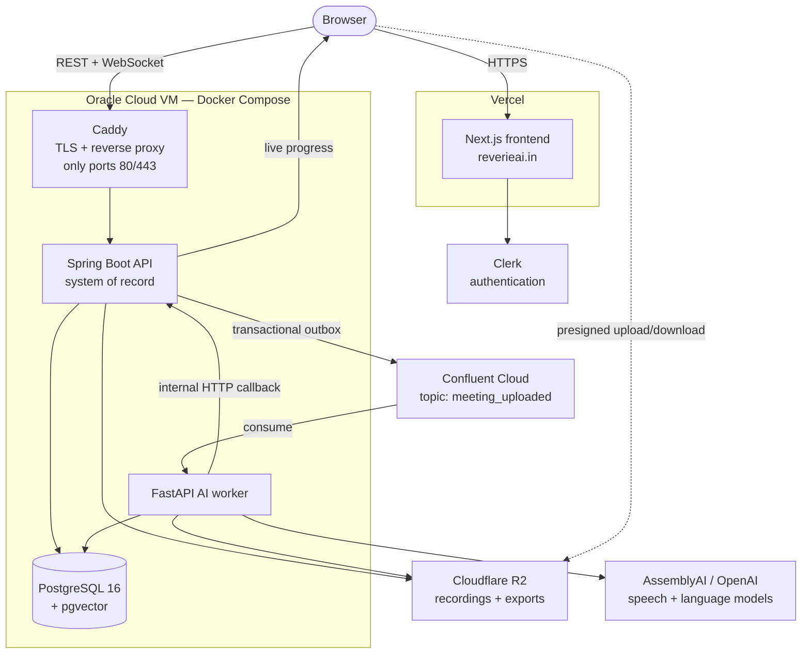

# Reverie

**Reverie turns a recorded conversation into a transcript you can read, notes you can act on, and answers you can ask for later.**

[](https://reverieai.in)


### ➡️ Live application: **https://reverieai.in**

---

## What is Reverie?

Record a meeting in your browser, or bring an audio or video file you already
have. Reverie writes down what was said, separates the speakers, and turns the
conversation into a short set of notes: a summary, the decisions that were made,
the risks that were raised, and the tasks somebody agreed to do.

Everything then stays searchable. Look for a phrase anyone said weeks ago, or
ask a question in plain English — about one meeting or across all of them — and
get an answer with links back to the exact lines of transcript it came from.
Nothing is asserted without showing you where it came from.

You can also read a meeting in another language, correct anything Reverie got
wrong, organise meetings into folders, export what you need, and set your own
schedule for when recordings are deleted.

## The Problem

A recording is not a record. After a meeting you are usually left with an hour
of audio nobody will play again, notes that stop where somebody stopped typing,
a decision everyone remembers differently, tasks agreed out loud and written
down nowhere, and no way to find the thing that was said three weeks ago.

Reverie closes that gap. The recording becomes text, the text becomes a short
set of notes, and the notes stay answerable — so "what did we decide about
this?" has somewhere to be asked.

## Who It Is For

Students recording lectures and research interviews · professionals in more
meetings than they can write up · developers and small teams tracking decisions
and follow-ups · anyone taking interview notes who needs quotes attributed to
the right person · anyone who needs to find something said weeks ago.

Reverie is a single-account product today: each account sees only its own
meetings, and there are no shared workspaces, members or invitations.

## Live Demo

**[reverieai.in](https://reverieai.in)** — sign in or create an account there.

Every account gets the same free allowance: **100 minutes of transcription for
the life of the account** and **3 imported files**. Recording in your own
browser spends minutes but does not count as an import. There is no paid tier
and no card, no shared demo account, and no credentials published here.

## Product Preview

<!--
  SCREENSHOTS TO BE ADDED. Nothing here shows the running application, and the
  design material is not a substitute: docs/ui-redesign/screens/ is the
  archived first design round, and docs/ui-redesign/v2-screens/ are renders of
  the standalone design-demo/ prototype, several showing surfaces the product
  does not have (Memory, a commitment ledger, link and document import).

  Capture from https://reverieai.in: landing page; Home with the ask panel; a
  summary with decisions, risks and action items; the transcript with speakers
  and timestamps; Ask Reverie with a citation resolved into the transcript; and
  recording in the browser with live words.
-->

_Screenshots of the live application are not yet in this repository. See
[reverieai.in](https://reverieai.in) for the product itself._

## Core Features

Everything below is reachable from the product's own interface today.

### Capture

- **Record in the browser** — nothing to install, words appear on screen while
  you speak, and navigating away does not stop the recording.
- **Import an audio or video file** you already have.
- **Transcription in 18 languages**, auto-detected or fixed in your settings.
- **Speakers separated and numbered** in the order they spoke, and renameable.
  Labelling is per word, so a two-word interjection inside someone else's
  sentence is attributed to whoever actually said it.

### Understand

- **A summary with key points**, written to a **template** you pick per meeting
  — a 1:1, an interview and a project meeting are each written up as what they
  are — and re-runnable afterwards.
- **Decisions and risks**, read out of that summary so the list and the prose
  cannot disagree, and editable, because a record nobody can correct is a
  record nobody should trust.
- **Action items** with owners, due dates and comments, and **quotations
  checked against the transcript** before they are stored.
- **Read the whole meeting in another language** — summary, tasks, transcript,
  kept once made so reopening it costs nothing.

### Find things later

- **Ask questions about one meeting or across all of them**, and get answers
  with citations that resolve to the supporting lines of transcript. **Quick**
  reads the strongest evidence; **Thorough** reads more of the conversation.
- **Search everything** — titles, tags and every sentence anyone said —
  narrowed as you type by tag, type, folder and date range, completed from what
  your account actually contains.
- **A navigable outline** of each meeting, and jump-to navigation inside it.

### Organise and correct

- **Folders** (up to 200), **tags**, filtering by a stretch of time, and
  **editing of the transcript text and speaker labels** when something came
  through wrong.
- **Highlights, bookmarks and notes** anywhere in a transcript, up to 2,000 per
  meeting.
- **Playback driven by the transcript, not the waveform** — 0.5× to 2× in seven
  steps, skip silence, jump between speakers, play only your highlights.
- **Notifications** when a transcript or summary is ready, when processing
  fails, when a meeting assigns work to you by name, or when your retention
  schedule deletes something.

### Export and control your data

- **Export** the summary and transcript as PDF and the recording as an MP3. One
  downloads directly, several arrive as a single ZIP, and a failed export
  downloads nothing rather than half.
- **Set your own deletion schedule** — separately for the recording and the
  whole meeting — and be told before and after it takes something.
- **Choose which emails Reverie may send you** across five switches, and
  **close the account**, which erases what is held.
- **Reverie does not train on your meetings.** Recordings, transcripts and
  notes are not used to train its AI.

## How Reverie Works

1. **Bring a meeting in** — record it or import a file. The file goes straight
   from your browser to object storage; it never passes through the API server.
2. **Reverie queues the work** and gives you back a page you can walk away from.
3. **The recording becomes a transcript**, with speakers separated and timings
   kept per word.
4. **The transcript becomes notes** — summary, key points, decisions, risks,
   action items — and is indexed so it can later be searched by meaning.
5. **Progress arrives live**, and the page still works if that connection drops.
6. **Ask, search, correct, organise, export** from the moment it is ready.

## Architecture



Three services, split where the work changes character. The **Spring Boot API**
is the system of record: it owns every row, checks who you are, enforces your
allowance, signs upload URLs, and never calls a model itself. The **FastAPI
worker** is stateless compute — transcribe, summarise, extract, index, post the
result back. **PostgreSQL** holds the business data *and* the vectors used for
search; **Cloudflare R2** holds the media.

The two are joined by a queue, not a phone call: the API enqueues one Kafka
event, `meeting_uploaded`, and the worker posts its result back over an internal
HTTP callback. Nothing waits on an open HTTP request while an hour of audio is
transcribed. See [Real-Time and Background Processing](#real-time-and-background-processing)
for how that is made reliable.

## Technology Stack

| Area | Technology |
|---|---|
| **Frontend** | Next.js (App Router), React, TypeScript, Redux Toolkit + RTK Query, Tailwind CSS, Radix UI, Framer Motion |
| **Backend** | Java 21, Spring Boot 3, Spring Security, Spring Data JPA, Spring Kafka, WebSocket (STOMP over SockJS), Flyway, Resilience4j, springdoc OpenAPI, OpenPDF |
| **AI service** | Python 3.12, FastAPI, Pydantic, aiokafka, psycopg 3, OpenAI SDK, httpx |
| **Data** | PostgreSQL 16 with `pgvector`; Cloudflare R2 via the AWS S3 SDK |
| **Messaging** | Apache Kafka (Confluent Cloud in production) |
| **Auth & AI providers** | Clerk; AssemblyAI (transcription, live streaming, speaker separation); OpenAI (summaries, extraction, chat, embeddings) |
| **Infrastructure** | Vercel, Oracle Cloud Ubuntu VM, Docker Compose, Caddy, Sentry |
| **Testing & CI** | Vitest, JUnit 5, pytest, k6, GitHub Actions |

## Engineering Highlights

- **A transactional outbox, not publish-after-commit.** The business rows and
  the event that triggers processing commit together or not at all, so a crash
  can never leave a paid-for meeting that nothing was told to process.
- **The relay is safe on every instance.** Rows are claimed with
  `FOR UPDATE SKIP LOCKED`, so two backends divide the backlog instead of both
  publishing all of it. Messages that can never be published are retired and
  stop blocking later events for the same meeting; transient failures retry with
  a backoff held in a column, so it survives a restart.
- **Tenant isolation enforced by PostgreSQL, not by convention.** Row-level
  security means a forgotten ownership check returns an empty result instead of
  another account's data — and it is armed by connecting as a role that *cannot*
  bypass it, rather than by a session setting any statement could change.
- **Reprocessing cannot be overtaken by its own past.** Every run carries a
  number; callbacks, indexed chunks and usage claims are all scoped to it, and
  the search index is written while holding the meeting row. A redelivered old
  run can never overwrite a newer transcript or a hand-typed correction.
- **Recordings never pass through the API.** Uploads and downloads use
  short-lived presigned URLs against a private bucket, so an hour of audio does
  not cross the JVM — which is what lets the API run in a small container.
- **Live transcription without shipping a key to the browser.** Audio streams
  from the tab straight to the speech provider using a token that expires in
  under a minute and can do exactly one thing. The endpoint minting those tokens
  is rate limited, because unlimited it hands out billable third-party
  credentials on demand.

## AI and Search

**How a question gets answered.** Reverie does not hand a whole archive to a
language model and hope. A finished transcript is split into passages, and each
passage becomes a list of numbers representing its meaning, stored in PostgreSQL
using the `pgvector` extension. A question becomes numbers the same way, the
closest passages are fetched, and only those — plus the decisions and action
items already on record — go to the model, which answers with citations pointing
at what it used. Retrieving the relevant material *before* generating an answer
is commonly called **retrieval-augmented generation (RAG)**.

**Retrieval is allowed to say no.** A nearest-neighbour search always returns
something: asked about a topic nobody ever discussed, it returns the least
unrelated passages with the same confidence as a real match. A filter discards
those, and its thresholds were **measured against a real indexed account**
rather than guessed — answerable questions bottom out around 0.6 cosine
distance, absent material starts around 0.87, and the cutoff sits in the empty
band between. Without it, the answer to an unanswerable question is a confident
paragraph about nothing.

**Claims are checked.** A quotation the model produces is matched back against
the transcript before being stored, and one that cannot be found is dropped.
Decisions and risks are *read out of* the summary already written rather than
extracted by a second model call — an earlier version did the latter and
produced a list that disagreed with the summary beside it, with no way for the
reader to tell which to trust.

**Two providers, chosen separately**, because speech and language are different
decisions, and both sit behind ports so either can be swapped by configuration.
Transcription runs on AssemblyAI's Universal-3.5 Pro, which separates speakers
and supports the eighteen languages the product offers — that support is the
hard limit on what Reverie can accept. Summaries, extraction, chat and
embeddings run on OpenAI models. A mock provider gives deterministic output for
local development and the test suites, with no key and no network.

Telling apart who is talking, and labelling every *word* rather than every turn,
is called **speaker diarization** — see [docs/diarization.md](docs/diarization.md).
Reverie can also read a name out of the conversation itself ("I'm good,
Charles") to suggest who a speaker is; see
[docs/speaker-naming.md](docs/speaker-naming.md). It does **not** recognise
voices across meetings — naming a speaker is a rename you make.

## Real-Time and Background Processing

Transcribing an hour of audio takes minutes, and none of that is the user's
problem. **Plainly:** Reverie accepts the meeting, queues the work, and gives
you a page you can leave — close the tab, come back later, and the meeting is
where you left it. **Technically:**

- **Kafka carries the work.** The event is published through the outbox, so it
  exists if and only if the meeting does, and the worker commits its offset only
  after the API has accepted a terminal outcome — so a worker that dies mid-run
  replays the meeting rather than losing it. Results return over an internal
  HTTP callback, authenticated by a shared token and written in one transaction
  with the status.
- **Progress arrives over a WebSocket** (STOMP over SockJS) per meeting — an
  optimisation, not a dependency. PostgreSQL holds the status and the browser
  polls as well, so a dropped frame costs latency, not correctness. Both sides
  share the same progress floors, so the bar cannot run backwards.
- **The slow stages run in parallel.** Summarising and extracting action items
  read the same transcript and are independent, so analysis costs the slower of
  the two rather than their sum. Search indexing starts the moment the
  transcript exists, while analysis is still running.
- **Scheduled jobs** cover the rest: the outbox relay and its purge, the mail
  relay and its purge, the retention pass, the retention warning, and a daily
  task reminder.

## Security and Data Protection

- **Clerk authentication** in production; the API validates Clerk JWTs. A
  header-based development mode exists, and the production profile refuses to
  start if it is still switched on.
- **Row-level security** in PostgreSQL isolates every account. User traffic
  connects as a role that cannot bypass it; the few paths with no user behind
  them use a separate pool and role. Splitting by database role rather than a
  session flag means no statement can promote itself.
- **Private object storage** — nothing public, everything reached by a
  short-lived presigned URL, with server-side encryption asserted at startup.
- **Rate limiting** on the endpoints that cost money (upload-URL signing,
  streaming tokens), which does not fail open; **request validation** with a
  shared error shape; and an **audit log** for upload, export and delete.
- **Security headers** including an enforced Content-Security-Policy, HSTS,
  `X-Frame-Options: DENY` and a restrictive `Permissions-Policy`.
- **A production start-up check** that refuses to boot on development
  settings, a pooled database URL that would break tenant isolation, or an
  unroutable mail sender — naming every problem at once, not just the first.
- **Logs are built not to carry content.** Transcript text, summaries and quoted
  lines are kept out of log output and error reports, with tests asserting it.
- **Erasure is real.** Closing the account deletes the data, the retention
  schedule deletes on the timetable you set, and a recording already erased says
  so on the meeting page.

No formal certification is claimed. Reverie has not been audited against GDPR,
HIPAA, SOC 2 or any similar framework. Recordings are sent to third-party speech
and language providers, which handle them under their own terms — the product
says so on its own settings page.

## Production Deployment

| Piece | Where it runs |
|---|---|
| Frontend | **Vercel**, tracking `main`, at **reverieai.in** |
| API, AI worker, PostgreSQL | **one Oracle Cloud Ubuntu VM**, Docker Compose |
| TLS / reverse proxy | **Caddy** — the only container publishing ports (80, 443) |
| Database | **self-hosted PostgreSQL 16 + pgvector** on that VM |
| Storage · Messaging · Monitoring | **Cloudflare R2** · **Confluent Cloud** · **Sentry** |

The API, the worker and PostgreSQL publish no ports at all — they are reachable
only on Docker's internal networks, and the browser's only way in is Caddy.
Current release: **v1.0.0**.

Operationally: container health checks and `restart: unless-stopped` on every
service, Sentry in all three, and database backups from a systemd timer that
does not treat the upload as the end of the run — the archive is validated,
uploaded to Cloudflare R2, **read back**, and its checksum verified against what
was sent. Stated plainly: **there is no automated alerting**, no uptime figure
is claimed, and the only automatic recovery is container restart.

**[docs/deploy.md](docs/deploy.md) is the canonical deployment document** and the
authority here — architecture, branch model, host commands, backups and restore,
monitoring and the production smoke test. The host runbook (provisioning, first
boot, JVM sizing, measured resource limits) is
[deploy/oracle/README.md](deploy/oracle/README.md).

## Performance and Load Testing

A k6 harness in [backend-spring/load-testing/](backend-spring/load-testing/)
has been run, and every number in
[docs/load-testing-report.md](docs/load-testing-report.md) is measured — but
**read them with the report's own caveat:** they come from a local container
constrained to **512 MB and half a CPU** against a disposable PostgreSQL, and
**predate the move to the current Oracle Cloud host**. They describe capacity
*shape* and relative comparisons, not production benchmarks.

- **The acceptance gate is what was measured**, not what sounded good: p95 under
  200 ms at 50 virtual users, measured at **98.82 ms with zero errors**. An
  earlier 100-VU / 300 ms target was retired because it described roughly twice
  the CPU the service had, and **it is not recorded as having passed — it did
  not.**
- **Warm-up dominates short benchmarks.** Three identical runs went from a p95
  of 333 ms to 87 ms at 2.5× less CPU by the third pass, so anything measured
  earlier describes JIT compilation rather than capacity. The remaining ceiling
  was the CPU quota, not the code — `EXPLAIN ANALYZE` put the list query at
  0.103 ms and no index was missing.
- **Saturation is graceful**: at 100 VUs latency rose and every request was
  still answered correctly.
- **Rate limits were asserted exactly** — 200 allowed of 600, and 30 of 120 —
  because that distinguishes *a* limiter from *the right* limiter.

The report also documents a production out-of-memory kill that the benchmark
failed to predict, and why. Not covered by the harness, and said so: WebSocket
delivery, the AI paths, and the production host itself.

## Testing and Quality

Automated test suites cover all three services, and CI runs every one of them on
every pull request into `dev` and `main`.

| Suite | Tool | Run it |
|---|---|---|
| `frontend/` | Vitest | `cd frontend && npm test` |
| `backend-spring/` | JUnit 5 | `cd backend-spring && mvn test` |
| `ai-service/` | pytest | `cd ai-service && pytest` |

**CI** ([`.github/workflows/ci.yml`](.github/workflows/ci.yml)) runs four jobs in
parallel: the **frontend** (lint, type-check, tests, production build); the
**Spring** suite via `mvn verify`, so a change that passes its tests but breaks
the jar fails here rather than in the image build; the **AI service** via pytest
with dependencies installed from a hash-pinned lockfile; and **migrations from
empty** — every Flyway migration applied in order to a clean PostgreSQL +
pgvector, after which the real Spring context must start and map against the
schema that came out.

Nothing in CI contacts Clerk, OpenAI, AssemblyAI, R2 or Confluent. The suites
run offline, because a test needing live credentials cannot be trusted to fail
for the right reason.

Several suites run against a **real PostgreSQL**, skipped unless
`REVERIE_IT_DB_URL` is set, covering what mocks cannot show: concurrent outbox
claiming, retry and poison events, row-level security, concurrent reprocess
allocation, provisioning races, and mail-outbox durability and isolation. One
honest limit — **no test makes a live call to any provider**; adapter tests
cover response *mapping* against recorded payloads.

## Repository Structure

```
Reverie/
├── frontend/           Next.js app - every screen, and the API client
├── backend-spring/     Spring Boot API - system of record, auth, orchestration
│   ├── src/main/resources/db/migration/   Flyway migrations (the schema)
│   └── load-testing/   k6 scripts
├── ai-service/         FastAPI worker - transcription, summaries, retrieval
├── deploy/oracle/      Production Compose file, Caddyfile, DB role init
├── docs/               API contracts, deployment, investigations
├── docker-compose.yml  Local development - the three application services
└── .env.example        Every configuration value, documented
```

`design-demo/`, `design-system/` and `docs/ui-redesign/` hold design work and a
standalone HTML prototype; they import nothing from the application.

## Getting Started

The local Compose file builds the three application services and nothing else —
there are no local infrastructure containers, so you must supply:

- **PostgreSQL 16 + pgvector** — the schema needs the `vector` extension. Use
  the **direct** endpoint, not a transaction-mode pooler: tenant isolation is
  armed per connection, and the app refuses to start on a pooled URL.
- **A Kafka broker**, and **S3-compatible object storage** (Cloudflare R2 or
  equivalent) — there is no bundled local object store.

Authentication and AI need **no** accounts: development mode accepts a header
instead of Clerk, and the mock AI provider returns deterministic transcripts and
summaries with no key and no network calls.

```bash
git clone https://github.com/CHAITANYAGANDI/Reverie.git
cd Reverie
cp .env.example .env
```

Set at least `SPRING_DATASOURCE_URL`, `FLYWAY_URL`, `KAFKA_BOOTSTRAP_SERVERS`,
`PG_HOST` and the `S3_*` values — Compose fails fast and names any that are
missing. Leave `REVERIE_AUTH_MODE=dev` and `AI_PROVIDER=mock` for the
zero-account path.

```bash
docker compose up --build
```

Frontend on `:3000`, API on `:8080` (health at `/actuator/health`, Swagger at
`/swagger-ui.html`), AI service on `:8000` (`/health`, `/docs`). Flyway migrates
on backend start-up; Swagger and the actuator metrics endpoint are disabled
under the production profile.

Outside Docker: `npm run dev` in `frontend/`, `mvn spring-boot:run` in
`backend-spring/`, and [ai-service/README.md](ai-service/README.md) for the
worker. For the real pipeline set `AI_PROVIDER=openai` and/or
`TRANSCRIPTION_PROVIDER=assemblyai` with their keys; for real auth,
`REVERIE_AUTH_MODE=clerk`.

## Configuration

Every environment variable is documented — with the reasoning for each — in
**[.env.example](.env.example)**. No secret value is committed, and none
belongs in the repository. The categories are authentication, database (runtime,
migration and worker connections plus the three database roles), AI and
transcription (provider, models, keys, timeouts), object storage, messaging, the
internal token guarding worker callbacks, mail, and Sentry.

Frontend variables live in the Vercel project rather than here, and every
`NEXT_PUBLIC_*` is inlined at build time — changing one requires a rebuild. See
[docs/deploy.md](docs/deploy.md).

## Documentation

| Document | What it covers |
|---|---|
| [docs/deploy.md](docs/deploy.md) | **Canonical.** How Reverie is deployed today, end to end |
| [deploy/oracle/README.md](deploy/oracle/README.md) | Host runbook — provisioning, first boot, JVM sizing, resource limits |
| [docs/api-contracts.md](docs/api-contracts.md) | REST, Kafka and WebSocket shapes shared by the three services |
| [db/migration/](backend-spring/src/main/resources/db/migration/) | The schema. Flyway owns it; read the migrations |
| [docs/ci-and-branch-protection.md](docs/ci-and-branch-protection.md) | What CI checks before a merge |
| [docs/diarization.md](docs/diarization.md) · [docs/speaker-naming.md](docs/speaker-naming.md) | Separating speakers, and reading a speaker's name out of the conversation |
| [docs/load-testing-report.md](docs/load-testing-report.md) | Measured load-test results — see the caveat above |
| [docs/ui-redesign/](docs/ui-redesign/) | The UI/UX study behind the current interface |

Kept as records of work and **historical rather than current**:
[speaker-identification.md](docs/speaker-identification.md) (voice identity,
removed — `V68` erases the data), [transcription-audit.md](docs/transcription-audit.md)
(pre-dates its own fixes), [database-schema.sql](docs/database-schema.sql) (the
original `V1` schema) and [demo-script.md](docs/demo-script.md) (an earlier
interface).

## Engineering Decisions and Trade-offs

**Why two backend languages.** Java for the transactional core and Python for
the AI work is where each ecosystem is strongest. The cost is real — two
deployables, two dependency sets, a contract between them — which is why
[docs/api-contracts.md](docs/api-contracts.md) is a document rather than an
assumption.

**Why PostgreSQL also stores the vectors.** A dedicated vector database would be
a second system to operate, back up and keep consistent with the first. With
`pgvector`, a passage and the meeting it belongs to are rows in one database,
under the same row-level security and the same backup. At much larger scale a
purpose-built index would win; at this size the operational simplicity is worth
more.

**Why the AI work is asynchronous.** A synchronous design would mean a request
held open for the length of a meeting, a tab that cannot be closed, and a retry
that pays a provider twice. The queue and the outbox make the work survive a
restart, which a background thread would not.

**Why production self-hosts PostgreSQL.** It used to be managed. Tenant
isolation is armed per connection, and a transaction-mode pooler hands the next
transaction a different server connection — which surfaces as an account with
nothing in it rather than as an error. Self-hosting removes that failure mode
and a network hop, at the cost of owning the backups. That cost is why the
backup verifies the checksum of what it reads back instead of trusting the
upload.

**Why Redis was removed rather than kept.** It held one thing: a burst counter.
Reverie runs a single backend instance, so a shared counter had nothing to share
with — and the Redis version failed *open*, meaning an outage silently removed
the limit from an endpoint that mints billable credentials. An in-process map
cannot be unavailable. If a second instance is added, this is the first thing
that changes back.

**Why features were deliberately removed.** Extracted decisions that disagreed
with the summary beside them, a cross-meeting commitment ledger and decision
drift, cross-meeting voice identity, Stripe billing, seven Kafka topics nothing
consumed but a logger, a four-format export picker, and emails reporting things
the reader could already see. Each went at the schema level rather than being
left standing, so nothing here is a capability a reader must prove is dead. The
voice templates were erased outright: biometric-adjacent data, collected for a
feature that no longer existed, with no screen left that could show anyone what
was held about them.

## Current Limitations

- **Single account, not a team workspace** — no members or invitations.
- **One free allowance that does not reset**, and no paid tier.
- **Some server capabilities are not exposed in the UI**, and are deliberately
  not listed as features above: semantic search, folder-scoped chat, per-meeting
  language re-transcription, the notification mute switches and the chat history
  window.
- **No live provider integration tests** — adapter tests cover response mapping
  against recorded payloads; nothing in CI calls AssemblyAI or OpenAI.
- **Rate limiting is per-instance**, exact on the single backend production runs
  but needing a shared store before a second one is added. The outbox relay
  itself is already safe on every instance.
- **Production operations are partly manual** — no automated alerting, and the
  Oracle host is updated by an operator running Compose against a reviewed
  commit or tag.
- **Load-test evidence predates the current host**, and **dark theme only.**

## Project Status

**Live** at [reverieai.in](https://reverieai.in), at release **v1.0.0**, under
active development.

Branching is `feature/*`, `fix/*` and `harden/*` into **`dev`** for
integration, then `dev` into **`main`** for production — merging into `main` is
what puts a new frontend in front of users, while the Oracle host is updated
separately by an operator. Releases are tagged; a tag is a record, not a
trigger. CI must be green to merge.

## About the Developer

Built by **Chaitanya Sai Gandi** — [GitHub](https://github.com/CHAITANYAGANDI).

Reverie is a portfolio engineering project built end to end: product design,
three services, the schema and its migrations, the deployment and the
operational runbooks. It is a real deployment holding real data — which is why
this document is as concerned with what was removed, and what is not
guaranteed, as with what works.
